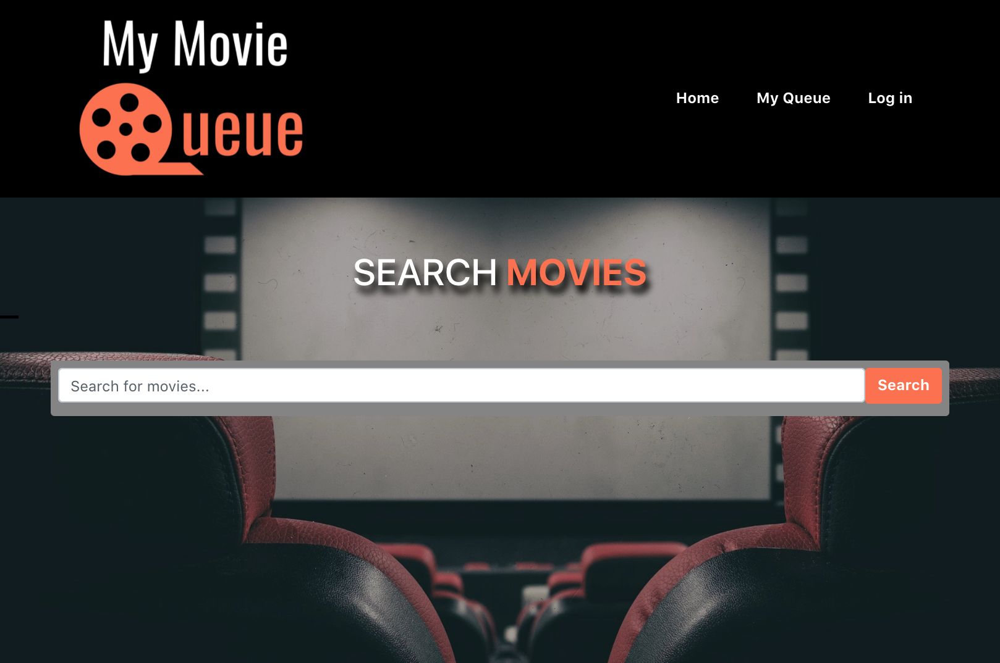
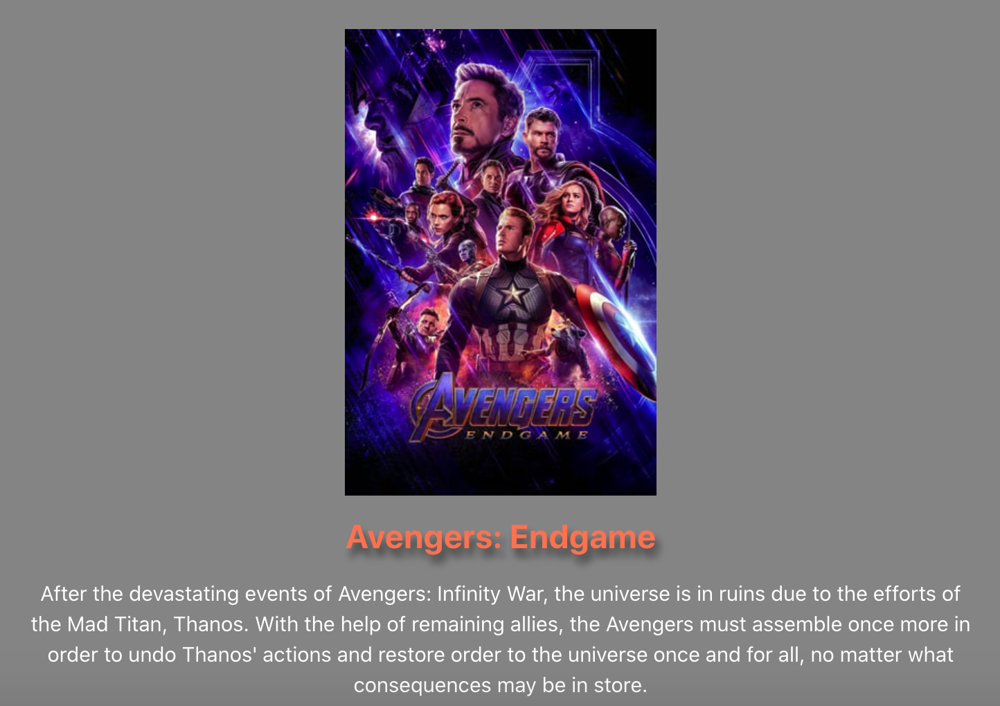

# My Movie Queue
## Description
Growing up in a land before digital cable boxes at a time when USA network and Comedy Central played more than box office hits, I'd often stumble onto a movie and quickly forget the name. One example being Airborne. 

This application aims to solve that by creating a one stop movie source for every Cinephile or average movie goer, where you will be able to capture, list those movies and more. 

The application allows users to search movies and find information about them. Due to time and scheduling constraints, my team was unable to add all the intended features. 

So Coming Soon: There will be the ability save to 3 lists (Watched, Gotta Watch, My Movie Shelf). Additionally I will add more information directly to the movie profile as well as gamification components (badges based on number of movies watched and owned etc).

Understanding the many ways to adjust or add to this project, we elected to go with the flexibility and scalability that React, Express, Node.JS, MongoDB, GraphQL offered. Due to the ease of use and documentation, we selected The Movie Database API for our main information source. 

## Table of Contents
* [Usage](https://github.com/kesiahp18/my-movie-queue#usage)
* [Technologies](https://github.com/kesiahp18/my-movie-queue#technologies)
* [Contributors](https://github.com/kesiahp18/my-movie-queue#contributors)

## Usage
This is a web application that can be visited [here](https://my-movie-q.herokuapp.com/). The design is simple and intuitive. As you search, movies will start appearing. You can then hit the respective buttons to transfer to the TMD page for extra info and there are placeholder buttons for the save functionality.

## Technologies
* React
* Node.js
* Bootstrap
* Graphql
* Apollo
* MongoDB
* Express
* bcrypt
* TMDB
* Dotenv

## How You Can Contribute
There are a couple of areas where help would be appreciated. On one hand, if you'd like to contribute and assist with building out the save functionality, I'd welcome the help. Secondly, if you have any ideas that you believe would help the application. Much of what I described is my vision, but I believe that added perspectives would bring improvements. If you are interested in contributing, email me at jonathan.robinson@outlook.com.

## Contributors

The original application was created by [Kesiah Patil](https://github.com/kesiahp18), [Melanie Schellberg](https://github.com/mschellberg), [Jonathan Robinson](https://github.com/Jonathan-84), and [Maria Cannon](https://github.com/MCannon33). 
